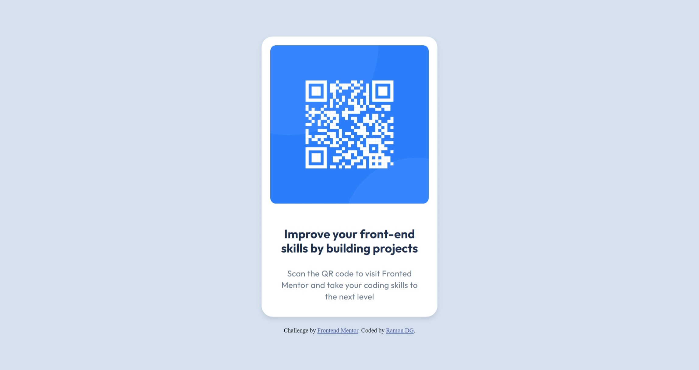

# Frontend Mentor - QR code component solution

This is a solution to the [QR code component challenge on Frontend Mentor](https://www.frontendmentor.io/challenges/qr-code-component-iux_sIO_H). 

## Table of contents

- [Overview](#overview)
  - [Screenshot](#screenshot)
  - [Links](#links)
- [My process](#my-process)
  - [Built with](#built-with)
- [Author](#RamonDG)

## Overview

### Screenshot

-Desktop

-Mobile

### Links

- Solution URL: [https://github.com/RamonDG-44/QR-Code-Component] 
- Live Site URL: [https://ramondg-44.github.io/QR-Code-Component]

## My process

### Built with

- Semantic HTML5 markup
- CSS custom properties
- Flexbox
- Media Queries

## Author

- Website - Loading...
- Frontend Mentor - [(https://www.frontendmentor.io/profile/RamonDG-44)]
- Git - [https://github.com/RamonDG-44]

